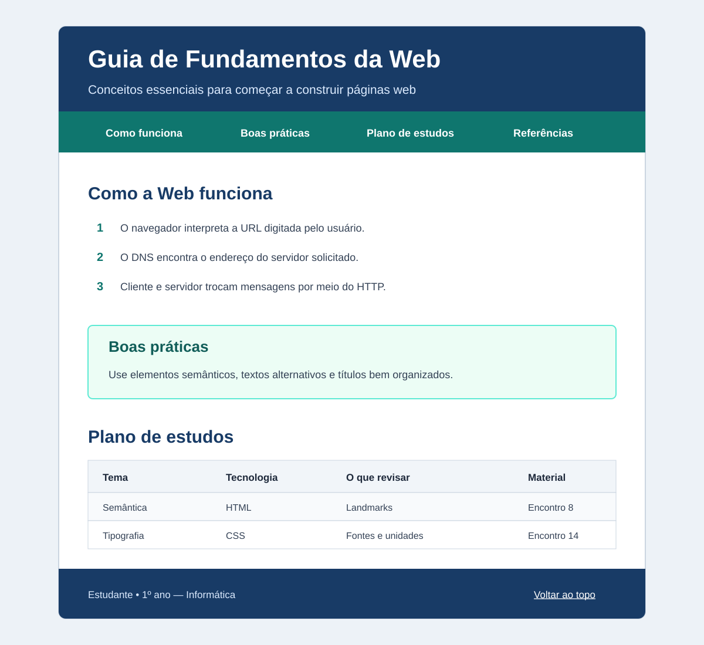

# Atividade Avaliativa - 2º Bimestre 

**Instituto Federal de Educação, Ciência e Tecnologia do Rio Grande do Norte**  
**Campus Currais Novos**

| Turma | Disciplina | Docente | Data |
|---|---|---|---|
| 1º ano — Informática | Autoria Web | Luciano Alexandre de Farias Silva | ____/____/______ |

**Discente:** ________________________________________________

## Orientações

- A atividade avaliativa deverá ser realizada de forma individual.
- Poderá ser realizada consulta apenas ao material utilizado pelo docente durante as aulas. Não poderá ser utilizado nenhum outro tipo de consulta durante a realização da atividade.
- O código-fonte deverá ser enviado pela plataforma Google Sala de Aula.
- O envio deverá ser realizado até o horário informado pelo docente. Não será possível enviar a atividade após o fechamento da plataforma.

## Problema

Você deverá criar, do zero, uma página chamada **Guia de Fundamentos da Web**. Ela será um material de consulta para estudantes iniciantes e deverá explicar conceitos estudados nos encontros da disciplina de Autoria Web, por meio de uma estrutura HTML5 semântica e de uma identidade visual produzida com CSS.

A atividade integra os fundamentos da Web, a organização de conteúdo em HTML e os primeiros recursos de apresentação visual em CSS. Não é necessário utilizar JavaScript nem técnicas de layout que ainda não tenham sido estudadas.

## Organização e entrega

1. Crie uma pasta com seu nome e sobrenome `nome-sobrenome`.
2. Dentro dela, crie os arquivos `index.html` e `styles.css`.
3. Desenvolva todo o código a partir de arquivos vazios.
4. Entregue a pasta completa, compactada em formato `.zip`, pelo Google Sala de Aula.

## Requisitos da página

### 1. Estrutura do documento

- usar `<!doctype html>` e o idioma `pt-BR`;
- incluir `meta charset`, `meta viewport` e `title` dentro do `head`;
- definir o título da aba como **Guia de Fundamentos da Web**;
- conectar corretamente o arquivo externo `styles.css` com `link`;
- organizar o `body` com `header`, `nav`, `main` e `footer`;
- manter indentação consistente e aninhamento correto.

### 2. Cabeçalho e navegação

- criar um `h1` com `id="topo"` e um parágrafo de apresentação;
- criar um `nav` com `aria-label="Navegação principal"`;
- inserir links internos para `#funcionamento`, `#boas-praticas`, `#estudos` e `#referencias`;
- garantir que cada link possua um destino existente;
- incluir no rodapé o link **Voltar ao topo**, apontando para `#topo`.

### 3. Seção “Como a Web funciona”

Crie `section id="funcionamento"` contendo:

- um `h2`;
- um parágrafo que diferencie Internet e Web;
- uma lista ordenada que explique, resumidamente, o que acontece entre digitar uma URL e visualizar uma página;
- uma explicação que use corretamente os termos **URL**, **DNS**, **HTTP**, **cliente**, **servidor** e **navegador**;
- um link externo para o material da disciplina.

O texto do link deve explicar claramente qual material será aberto.

### 4. Seção “Boas práticas”

Crie `section id="boas-praticas"` contendo:

- um `h2`;
- um `article` com pelo menos três recomendações sobre semântica, acessibilidade ou organização do código;
- um `aside` com um aviso curto sobre um erro comum de iniciantes.

### 5. Seção “Plano de estudos”

Crie `section id="estudos"` com uma tabela contendo:

- `caption` descritivo;
- `thead` e `tbody`;
- as colunas **Tema**, **Tecnologia**, **O que revisar** e **Material**;
- cabeçalhos `th` com `scope="col"`;
- pelo menos quatro linhas de dados;
- pelo menos um link para um material de revisão.

### 6. Referências e rodapé

- criar uma área identificada por `id="referencias"`;
- apresentar, em uma lista, pelo menos duas fontes consultadas;
- inserir no `footer` o nome do estudante, a turma e o link **Voltar ao topo**.

## Requisitos do CSS

O arquivo `styles.css` deverá conter:

- estilos para `body`, `header`, `nav`, `main`, `section` e `footer`;
- tipografia legível com `font-family`, `font-size` e `line-height`;
- hierarquia visual entre `h1`, `h2`, `h3` e os parágrafos;
- paleta de cores coerente e contraste adequado entre texto e fundo;
- conteúdo com largura máxima e centralização usando `max-width` e `margin`;
- aplicação intencional de `margin` e `padding`;
- uso de unidades relativas, como `%` e `rem`, nos tamanhos e espaçamentos principais;
- estilos por elemento, classe e identificador;
- destaque visual para o `aside`;
- estilos básicos para links e tabela.

## Exemplo visual do resultado esperado

O exemplo abaixo apresenta uma possibilidade de organização visual. Ele serve como referência para hierarquia, cores e espaçamentos; não é necessário reproduzi-lo exatamente. O conteúdo e o código deverão respeitar os requisitos desta atividade.

