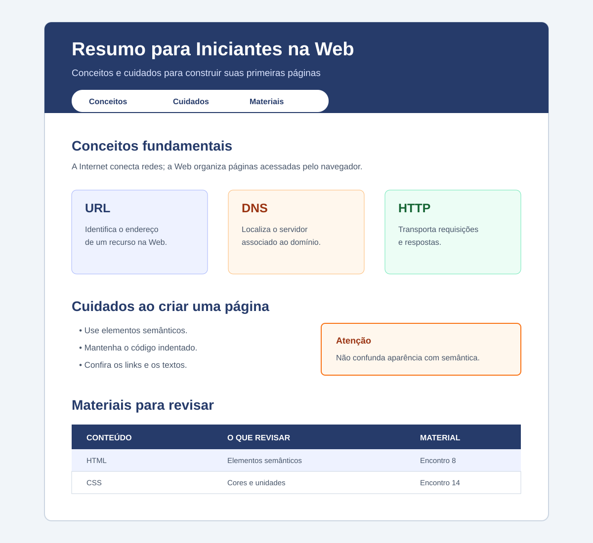

# Atividade Avaliativa - Reposição do 2º Bimestre

**Instituto Federal de Educação, Ciência e Tecnologia do Rio Grande do Norte**  
**Campus Currais Novos**

| Turma | Disciplina | Docente | Data |
|---|---|---|---|
| 1º ano — Informática | Autoria Web | Luciano Alexandre de Farias Silva | ____/____/______ |

**Discente:** ________________________________________________

## Orientações

- A atividade deverá ser realizada individualmente.
- Poderá ser consultado apenas o material utilizado pelo docente durante as aulas.
- O código-fonte deverá ser enviado pelo Google Sala de Aula até o horário informado pelo docente.

## Problema

Crie, do zero, uma página chamada **Resumo para Iniciantes na Web**. Ela deverá apresentar três conceitos fundamentais da Web, recomendações para escrever uma boa página HTML e materiais para revisão.

A página deverá utilizar HTML5 semântico e um arquivo CSS externo. O menu e os cartões de conceitos deverão ser organizados com Flexbox. Não utilize JavaScript, Grid, media queries ou outros recursos ainda não estudados.

## Organização e entrega

1. Crie uma pasta chamada `nome-sobrenome`.
2. Dentro dela, crie `index.html` e `styles.css`.
3. Produza os dois arquivos a partir de arquivos vazios.
4. Compacte a pasta em `.zip` e envie-a pelo Google Sala de Aula.

## Requisitos do HTML

### 1. Estrutura do documento

- usar `<!doctype html>` e `html lang="pt-BR"`;
- incluir `meta charset`, `meta viewport` e `title` no `head`;
- usar **Resumo para Iniciantes na Web** como título da aba;
- conectar o arquivo `styles.css` com `link`;
- organizar o `body` com `header`, `nav`, `main` e `footer`;
- manter aninhamento e indentação corretos.

### 2. Cabeçalho e menu

No `header`:

- criar um `h1` com `id="topo"`;
- escrever um parágrafo curto de apresentação;
- criar um `nav` com links para `#conceitos`, `#cuidados` e `#materiais`;
- garantir que todos os links internos tenham destinos existentes.

### 3. Conceitos fundamentais

Crie `section id="conceitos"` contendo:

- um `h2` e um parágrafo que diferencie Internet e Web;
- uma `div` com `class="cartoes"`;
- dentro dessa `div`, três elementos `article` com `class="cartao"`;
- em cada `article`, um `h3` e um parágrafo;
- um cartão sobre **URL**, um sobre **DNS** e um sobre **HTTP**;
- ao explicar HTTP, mencionar corretamente cliente, servidor, requisição e resposta.

### 4. Cuidados ao criar uma página

Crie `section id="cuidados"` contendo:

- um `h2`;
- uma lista não ordenada com pelo menos quatro cuidados relacionados a semântica, indentação, links ou acessibilidade;
- um `aside` com um alerta curto sobre um erro comum de iniciantes.

### 5. Materiais para revisar

Crie `section id="materiais"` com uma tabela contendo:

- `caption`, `thead` e `tbody`;
- as colunas **Conteúdo**, **O que revisar** e **Material**;
- `th` com `scope="col"`;
- pelo menos três linhas de dados;
- pelo menos um link para um material da disciplina.

### 6. Rodapé

No `footer`:

- informar o nome do estudante e a turma;
- criar o link **Voltar ao topo**, apontando para `#topo`.

## Requisitos do CSS

O arquivo `styles.css` deverá:

- criar em `:root` pelo menos três variáveis para cores;
- estilizar `body`, `header`, `nav`, `main`, `section`, `article`, `aside` e `footer`;
- usar seletores de elemento, classe e identificador;
- definir `font-family`, `font-size` e `line-height`;
- aplicar cores com contraste adequado;
- limitar e centralizar o conteúdo com `max-width` e `margin`;
- usar `margin`, `padding` e unidades relativas, como `rem`;
- organizar o menu com `display: flex` e `gap`;
- organizar `.cartoes` com `display: flex`, `gap` e `flex-wrap`;
- dar aos cartões borda, cor de fundo e espaçamento interno;
- destacar visualmente o `aside`;
- aplicar estilos básicos aos links e à tabela.

## Exemplo visual do resultado esperado

O exemplo indica uma organização possível para o cabeçalho, os cartões, a lista e a tabela. Não é necessário copiá-lo exatamente.

