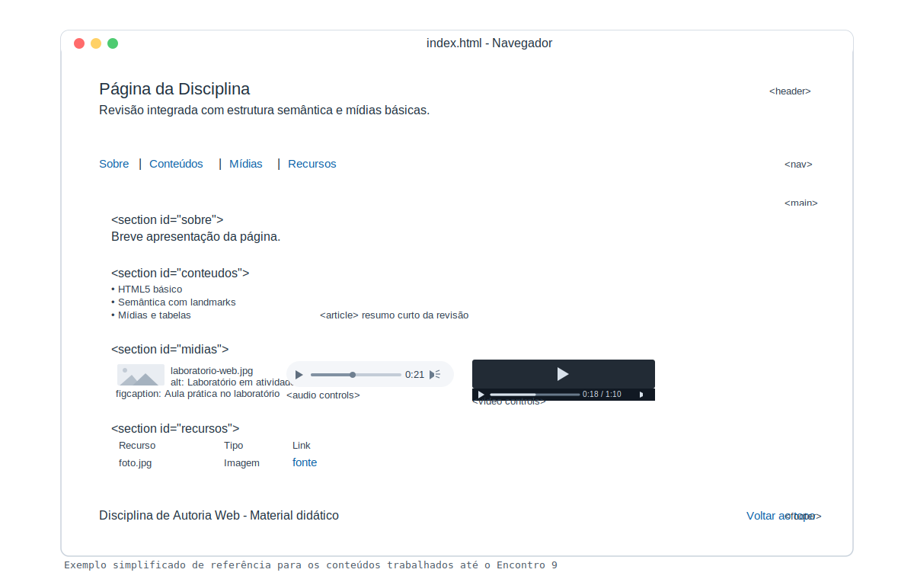

# Encontro 10 - Lista de Exercícios 

## Visão Geral
Neste encontro, você fará uma revisão prática dos conteúdos já trabalhados.
O objetivo é montar **uma única página principal** (`index.html`) com estrutura semântica básica e elementos essenciais.

## Instruções rápidas
1. Use apenas um arquivo: `index.html`.
2. Cada exercício continua o anterior.
3. Mantenha indentação organizada e teste no navegador após cada etapa.
4. Se não tiver mídia local, use URLs externas válidas para `img`, `audio` e `video`.

## Exercícios
1. Monte a estrutura mínima do HTML5 com `<!doctype html>`, `html`, `head`, `meta charset`, `meta viewport`, `title` e `body`.
2. No `body`, adicione `header` com `h1` (id `topo`) e 1 parágrafo de apresentação.
3. Abaixo do `header`, crie um `nav` com 4 links internos: `#sobre`, `#conteudos`, `#midias` e `#recursos`.
4. Adicione `main` para o conteúdo principal.
5. Dentro do `main`, crie uma `section` com id `sobre`, contendo `h2` e 1 parágrafo.
6. Crie outra `section` com id `conteudos`, contendo `h2` e uma lista `ul` com 3 itens.
7. Ainda em `conteudos`, adicione um `article` simples com `h3` e 1 parágrafo curto.
8. Crie uma `section` com id `midias` e título `h2`.
9. Na seção `midias`, insira uma `figure` com `img` (`alt` descritivo) e `figcaption`.
10. Ainda em `midias`, adicione um `audio controls` com `source` e texto de fallback.
11. Ainda em `midias`, adicione um `video controls` com `source`, largura definida e texto de fallback.
12. Crie uma `section` com id `recursos` e título `h2`.
13. Em `recursos`, monte uma tabela simples com `caption`, `thead`, `tbody`, 3 colunas (`Recurso`, `Tipo`, `Link`) e pelo menos 3 linhas.
14. Adicione `footer` com 1 parágrafo final e 1 link interno para `#topo`.
15. Revise a página: hierarquia de títulos, links funcionando, mídias carregando e tabela legível.

## Exemplo visual do resultado esperado

## Proposta de atividade avaliativa (modelo alternativo)
Para preparar o encontro avaliativo do bloco, use a proposta abaixo com foco em combinação de tags em conjuntos:

[Atividade Avaliativa 02 - Bloco 1 (HTML5 Integrado)](../atividades/03-atividade-avaliativa-02-html5-integrado.md)
